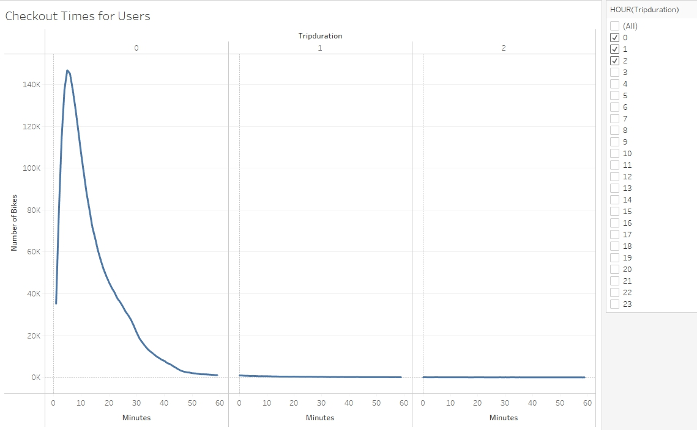
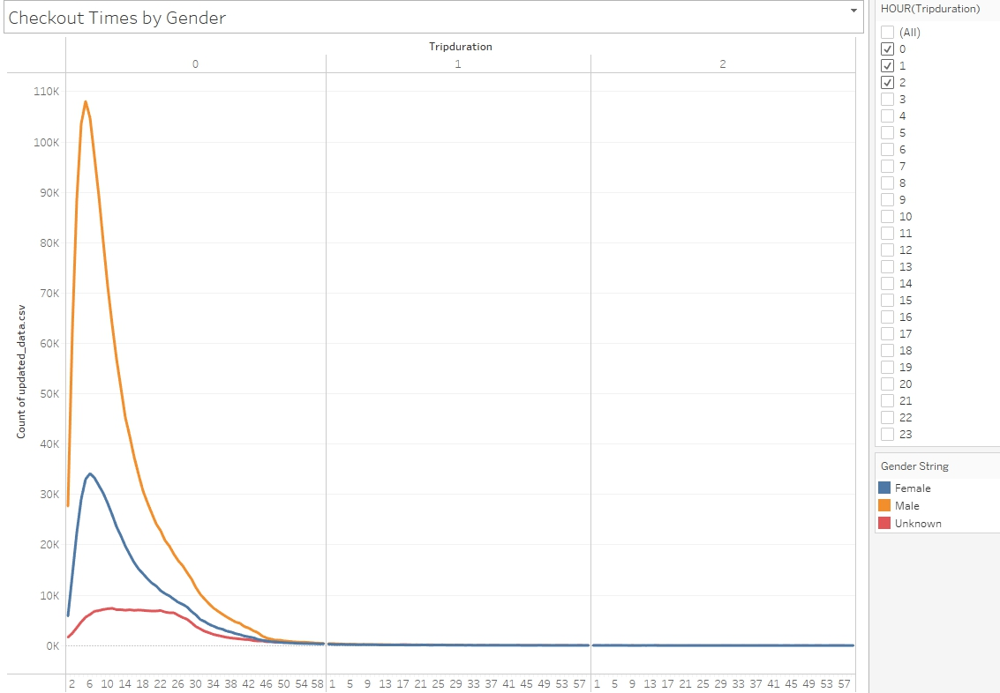
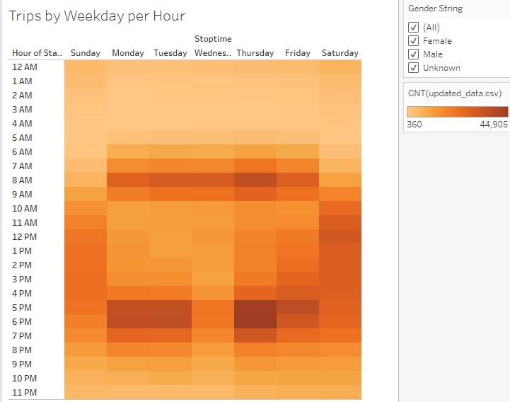
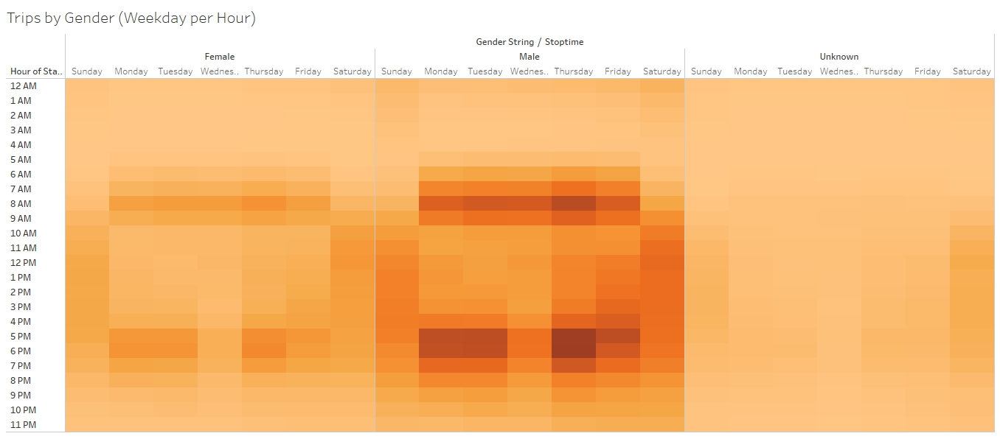
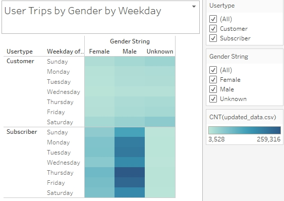
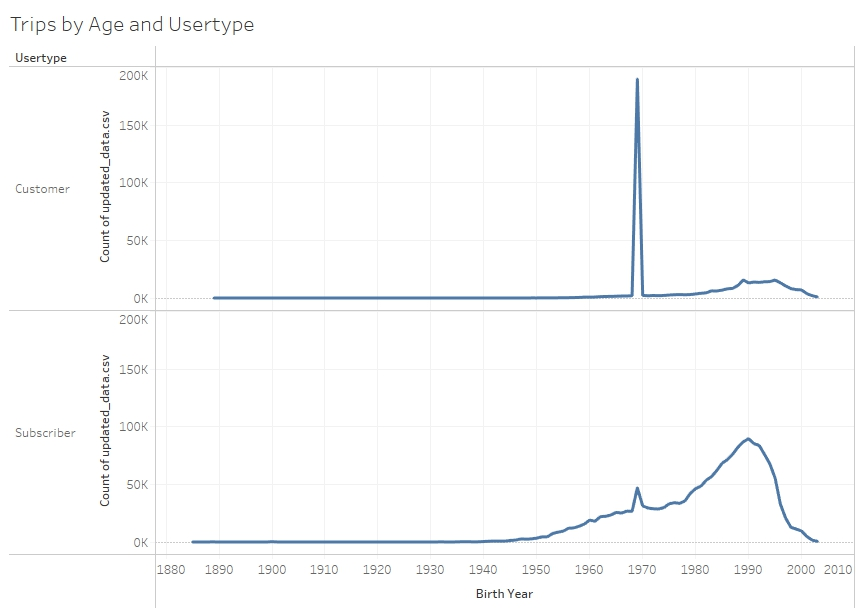
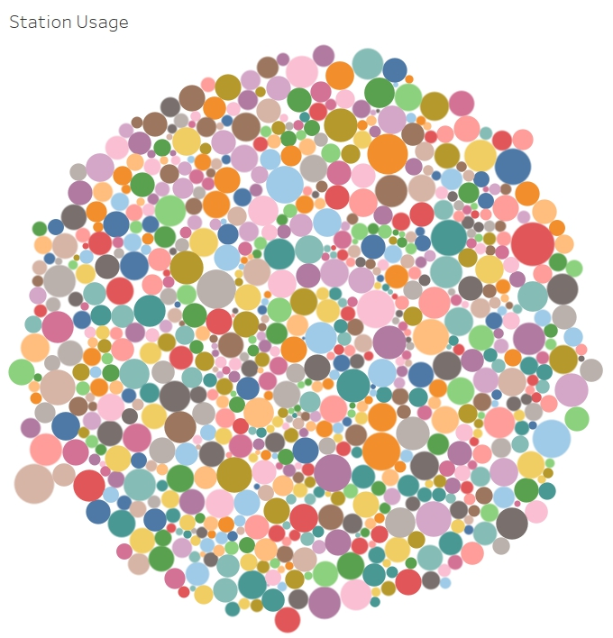

# NY Citibike Sharing
## Overview
Analyze NY Citibike's bikesharing program to create a persuasive proposal for investors to participate in launching a bikeshare program in Des Moines.  

## Resources
[Link to Tableau Dashboard](https://public.tableau.com/app/profile/gahyun.jeong/viz/15-NY_Citibike/NYCitibike?publish=yes)

## Results

Vast majority of the NY Citibkes are used for less than an hour. Of all rentals 146,752 bikes were used only for 5 minutes.

Men take the most advantage of NY Citibike, outnumbering females in the usage by far.

NY Citibikes were used the most during the rush-hours throughout the weekdays, and between 10AM and 6 PM on the weekends.

Even when dividing the data by gender, NY Citibikes shows similar trend where they are used most often during rush-hour on weekdays and between 10AM and 6PM during weekends. Also, below heatmap does show that there are more men using Citibkes than women.

There are a lot more subscribers who uses Citibkes than regular customers. In a business perspective, this ensures that there are a decent number of "regular" customers that utilizes the bikesharing service.

## Summary
Looking through NY Citibike's data, the vast majority of the customers are comprised of male population, utilizing the bikesharing services during rush-hour traffic in weekdays. There also is a good demand for usage throughout the weekend, more dispersed in usage times than during the weekdays. Des Moines bikesharing service will most likely need to target the working-class male to start and grow the business.

### Additional Suggestions

Above illustrates that there are far more usage by subscribers of the NY Citibike than one-time customers. Furthermore, bikesharing service seems to be more popular amongst the younger generation than that of the old. This suggests which age group to target the Des Moines bikesharing business - young male population.

Above graph shows how frequent each bike station in New York is used. The size of eadch circle indicates the frequency, large circles indicating higher usage. Generally speaking, it seems like most of tghe stations are visited rather frequently, suggesting that bikesharing customers and subscribers take advatange of the service throughout the entire city, not just in one area. 